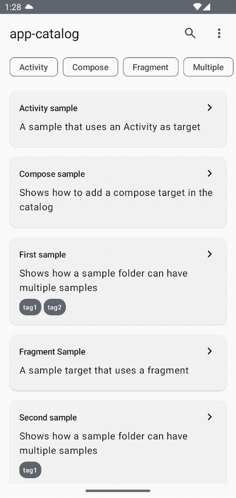

# Catalog Android Sample App

(CASA or "Home" in Spanish)

A framework to bootstrap the creation of catalog samples apps by removing all the boilerplate and
dynamically including all available samples into a single activity.

> 🚧 Work in-progress: this is an experiment project and it is under heavy development,
> APIs might change frequently.



## How to use it

Three main steps:

1. [Setup project structure](#setup-project-structure)
2. [Create catalog-app](#create-catalog-app)
3. [Create sample modules](#create-sample-modules)

> Note: you can also check the [app-catalog](app-catalog) folder for an example.

### Setup project structure

Create a project with the following structure (names can be changed):

- app
- samples/
    - first
    - second

> Note: the framework supports nested folders too (e.g samples/folder/first,
> samples/folder/second..)

For example, the `settings.gradle` might look like this:

```groovy
include ':app'
include ':samples:sampleOne'
include ':samples:sampleTwo'
// ...other samples
```

### Create catalog-app

This will be the application module that wires all the samples under a single app. It requires
three steps:

1. Set up build.gradle
2. Create the catalog activity and app classes
3. Setup `AndroidManifest.xml`

In the app module's `build.gradle` include the framework dependencies, Hilt and KAPT plugins:

```groovy
plugins {
    id 'com.android.application'
    id 'org.jetbrains.kotlin.android'
    id 'kotlin-kapt'
    id 'dagger.hilt.android.plugin'
}

android {
    // your app's configuration
}

dependencies {
    implementation "com.google.android.casa:casa-ui:$version"

    implementation "com.google.dagger:hilt-android:2.44.2"
    kapt "com.google.dagger:hilt-android-compiler:2.44.2"

    // include all module samples.
}
```

Then, create a new Activity that extends `CatalogActivity` and add the Hilt wiring for the
Application and Activity entry points:

```kotlin
@HiltAndroidApp
class MainApp : Application()

@AndroidEntryPoint
class MainActivity : CatalogActivity()
```

Finally, don't forget to declare them in the `AndroidManifest.xml`:

```xml

<application android:name=".MainApp" android:allowBackup="true">

    <activity android:name=".MainActivity" android:exported="true">
        <intent-filter>
            <action android:name="android.intent.action.MAIN" />

            <category android:name="android.intent.category.LAUNCHER" />
        </intent-filter>
    </activity>

</application>
```

### Create sample modules

Place any new samples under the samples folder and for each new module add the framework
dependencies and plugins in their `build.gradle` files:

```groovy
plugins {
    id 'com.android.library'
    id 'kotlin-android'
    id 'kotlin-kapt'
    id "com.google.devtools.ksp"
    id 'dagger.hilt.android.plugin'
}

android {
    // your configuration
}

dependencies {
    implementation "com.google.android.casa:casa-base:$version"
    ksp "com.google.android.casa:casa-processor:$version"

    implementation "com.google.dagger:hilt-android:2.44.2"
    kapt "com.google.dagger:hilt-android-compiler:2.44.2"

    // other dependencies like compose
}
```

Then create as many entry points as desired by annotating any composable function, activity or
fragment with the `@Sample` annotation:

```kotlin
@Sample(name = "Compose sample", "Shows how to add a compose target in the catalog")
@Composable
fun ComposeSample() {
    Box(Modifier.fillMaxSize()) {
        Text(text = "Hi, I am a compose sample target!")
    }
}
```

Each entry point will be automatically included in the main app and displayed for you.

## Contributions

Please contribute! We will gladly review any pull requests.
Make sure to read the [Contributing](CONTRIBUTING.md) page first though.
